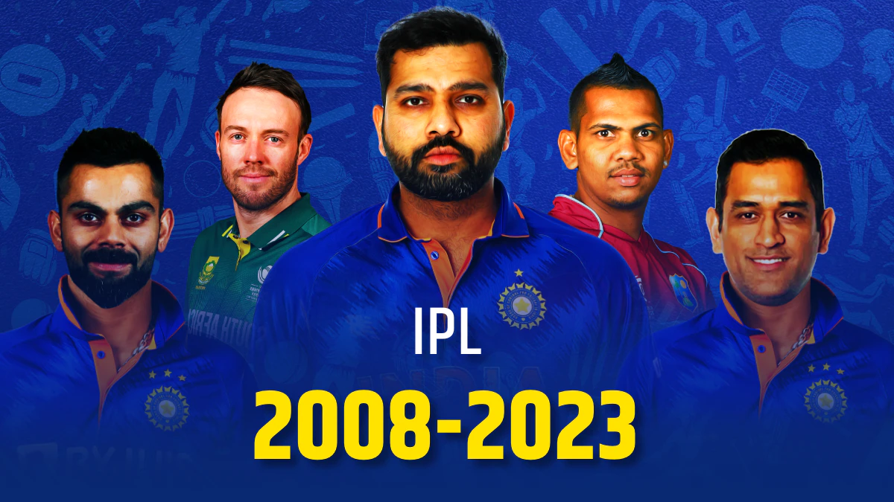

# Deep-Dive-into-16-Years-of-IPL-History

This project explores the rich history of the Indian Premier League (IPL) over 16 years, analyzing data from all seasons between 2008 and 2023. Using Jupyter Lab, PySpark, Python, and various data analysis techniques, we've delved deep into the IPL's matches, players, and statistics, solving more than 50 questions along the way.



## Table of Contents
- [Introduction](#introduction)
- [Features](#features)
- [Technologies Used](#technologies-used)
- [Installation](#installation)
- [Usage](#usage)
- [Contributing](#contributing)
- [License](#license)

## Introduction

The IPL is one of the most popular and competitive cricket leagues globally, attracting top players from around the world. This project aims to provide insights and analysis into the IPL's history, uncovering interesting trends and patterns.

## Features

- Analyzed data from all IPL seasons (2008-2023)
- Used Jupyter Lab and PySpark for data analysis
- Solved over 50 questions related to IPL matches and players

## Technologies Used

- Jupyter Lab
- PySpark
- Python

## Installation

1. Clone the repository:

   ```bash
   git clone https://github.com/your-username/your-repository.git
